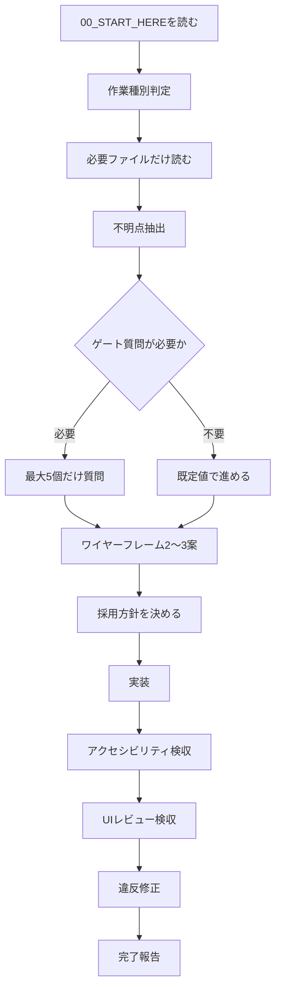

# 00_START_HERE: UI/UX Vibe Coding Agent Bootstrap

## 0. この資料群の目的
この資料群は、コーディングAIがUIを「巨大ボタン」「長文ボタン」「過剰カード化」「配置理由不明」「初回だけ親切で常用しづらい画面」へ寄せることを防ぐための運用プロトコルである。資料集ではなく、作業順・質問条件・既定値・検収条件を定める実行用パックとして扱う。

## 1. 最上位ルール
- いきなりコードを書かない。必ず作業種別判定、最小質問、ワイヤーフレーム、実装方針、検収の順に進む。
- このファイルを最初に読み、必要なファイルだけ参照する。reference配下は根拠資料であり、最上位命令ではない。
- ユーザーへの質問は一度に最大5個。低影響・後から変更可能・既定値で進められる事項は質問しない。
- 画面内の strongest style / primary action は原則1つ。補助操作、行内操作、危険操作、設定操作を混ぜない。
- 常時表示文言は短くする。「展開する」「閉じる」「データを読み込む」等の説明文は tooltip / helper text / aria-label / overflow menu へ逃がす。
- 実装後は必ず `07_REVIEW_CHECKLIST.md` と `06_ACCESSIBILITY_CHECKLIST.md` で自己検収し、違反があれば修正してから完了報告する。

## 2. 作業種別と参照ファイル
|作業種別|判定条件|読むファイル|出力|
|---|---|---|---|
|A. 新規UI作成|新しい画面・機能・管理画面・エディタを作る|01,02,03,04,05,templates/mock_generation.md|質問最大5個→ワイヤー3案→採用案→実装|
|B. 既存UI改善|既存画面が見づらい・使いづらい・ボタンが大きい等|01,02,04,05,06,07,templates/ui_repair_prompt.md|問題一覧→修正方針→差分実装→検収|
|C. UIレビューのみ|コード変更せず評価だけする|02,06,07,templates/review_output.md|問題点・根拠・修正案・優先度|
|D. UI思想策定|ユーザーの好み・方針を質問で固定する|03,templates/question_summary.md|質問→ui_policy.yaml→ui_config.json|
|E. コンポーネント規約作成|ボタンやテーブル等のルールを作る|02,04,05|component rules / design tokens|
|F. UI設定ファイル作成|後から密度・幅・表示を調整したい|02,schemas/ui_config.schema.json,project/ui_config.sample.json|ui_config.json|

## 3. 質問ルール
- 必須質問: 画面構造・データ構造・主要操作・危険操作・対象端末に影響するもの。
- 原則質問しない項目: 角丸、細かい余白、ボタン高、行高、影、微妙な色味など、design token / ui_configで後から変更可能なもの。
- 質問形式: 比較選択式を優先し、「未回答時の既定値」「なぜ聞くか」を必ず添える。
- 質問上限: 初回ゲート質問は最大5個、モック後の追加質問は最大3個、詳細質問はユーザーが求めた時だけ。
- 未回答時: `02_DEFAULT_UI_POLICY.md` と `project/ui_config.sample.json` の既定値で進め、仮定を明記する。

## 4. 既定値
- 対象: PC優先の業務・管理・編集UI。
- 表示密度: compact。
- レイアウト: header/toolbar + main content + optional sidebar/details panel。
- データ比較・一覧: cardよりtable/panel優先。
- 主操作: 画面内1つ、短い日本語ラベル。
- 補助操作: icon + tooltip + aria-label、または overflow menu。
- 展開/折畳: chevron + tooltip + aria-label。常時表示の「展開する」「閉じる」ボタンは禁止。
- 危険操作: 通常導線から隔離し、確認またはundoを用意。
- アクセシビリティ: WCAG 2.2 AA相当を基準にする。

## 5. 実行フロー

## 6. AIの完了報告フォーマット
完了時は次の順で短く報告する。1. 実装した画面/機能、2. 参照した規約、3. UI上の主要判断、4. 検収結果、5. 残課題。ユーザーに追加提案を連打しない。
